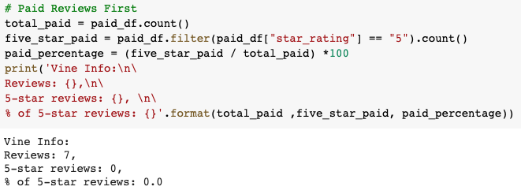
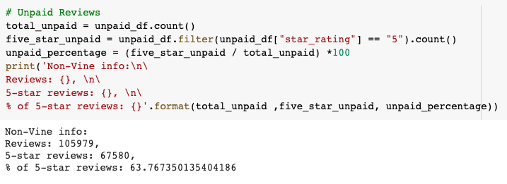

# Amazon_Vine_Analysis

## Purpose
We are looking to Analyze Amazon reviews written by members who pay for the Amazon Vine program and compare it to the reviews written by members who do not pay. We are hoping to find trends in who writes reviews, how many reviews, and how positive the reviews are for each type of member. For this project, we are focusing on Music category reviews.

## Results
- Vine member information:
    
    

- Non-Vine member information:
    
    

## Summary
- Is there Positivity Bias for reviews in the Vine Program?

    As seen in the results of the analysis above we know that for the Music category there are only 7 reviews left by vine members. Of these seven reviews, there are 0 five-star reviews. However, the reviews left by non-Vine members that are five-star reviews are about 63.8%. In this case with the Music category, we can see that there is no positivity bias for paying Vine members.
    
- Additional Analysis:

    In addition to the previous analysis, we could see if the number of 4 and 5-star reviews is much different for Vine and non-Vine members when comparing it to 5-star only reviews.